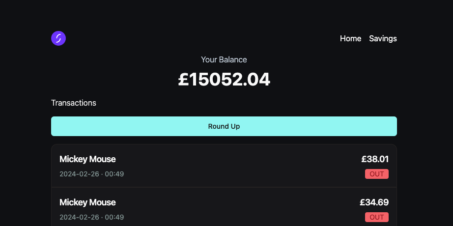

This is a [Next.js](https://nextjs.org/) project bootstrapped with [`create-next-app`](https://github.com/vercel/next.js/tree/canary/packages/create-next-app).

# Hasin Mahmood - Starling Graduate Software Engineer Tech Test

A quick video running through the entire project: https://youtu.be/I28c47rK5iA

### Latest update:

- A date picker for the user to select the starting date from when they want to view transactions.
- Depending on the date they choose they will see their transactions for that given week (the max date is set inside the slice)
- If they have no transactions for a selected week this will be told to them.
- The roundup amount dynmaically updates depending on what date they have selected, working out the amount for that given week.

#### Techstack:

`TypeScript, NextJS, Redux, shadcn, jest`

### How to run locally:

- Clone the repository
- Navigate into the cloned repository
- Create a `.env` file at the root level of the directory
- Follow the steps under the [getting started](https://drive.google.com/file/d/14AMzpp3bSCwnXM7OO3hNz5JsmLXa4PP1/view?usp=sharing) section of the following document.
- Inside the `.env` file you made make a variable called `ACCESS_TOKEN` and set it equal to your users token
  Your `.env` should look something like this:
  `ACCESS_TOKEN = eyJhbGciOiJQUzI1NiIsInppcCI6IkdaSVAifQ...`
- Run `npm add` to install dependencies
- Run `npm run dev` to start a local server
- Open up your browser and navigate to the url you see in your terimnal. Most times this is `http://localhost:3000/`
- To run unit tests run `npm test`

If you have followed these steps correctly you should see something like this (make sure you simulate some transactions for your user within your created sandbox!):

### What the site provides:

- On load the user will see their accounts balance will of their transactions from the past week.
- If the round-up amount for that week is non zero and is less than their balance they will have the option to transfer the round-up amount to a savings goal.
- When the user presses the round-up button:
  - They will be prompted to create a savings goal if they haven't got any associated with their account.
  - If they have savings goals they will be able to select from them and then transfer the roundup the one they choose.
- A navigation bar to switch between viewing the last weeks transactions or their savings goals.
- If the user navigates to the savings page with the nav bar:

  - All of their goals and their respective balances will be shown.
  - A button to create a new savings goal will be shown.
  - For each given savings goal they will have the option to delete them, BUT before they do an alert dialog will appear confirming if they want to go ahead.

- A responsive UI
- Robust error handling:

  - If there is an error when getting a users balance, transactions, or savings goals a blocking error message will be shown telling the user exactly where the site failed, even giving them a button to try again.
  - If something goes wrong when submitting a form a destructive toast will be shown
  - If the user does't include any required fields in a form they will not be able to submit it and an error message will be shown telling them what they are missing

- Skeleton Loaders so that while the api calls are pending the user doesn't see a blank screen

### Extra functionality that can be added:

- A way for the user to transfer money from their savings goal back to their account. To do this all you need to do is render a sheet with a form allowing the user to enter the amount they want to transfer back (I have already written the endpoint and redux thunks for this).
